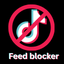
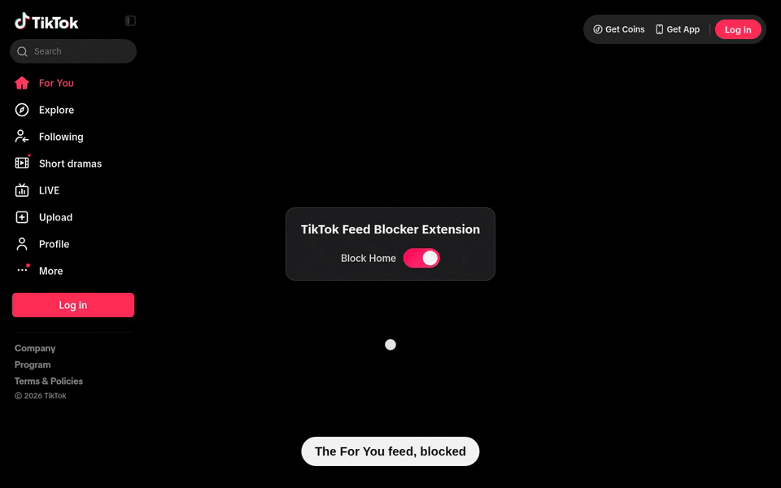
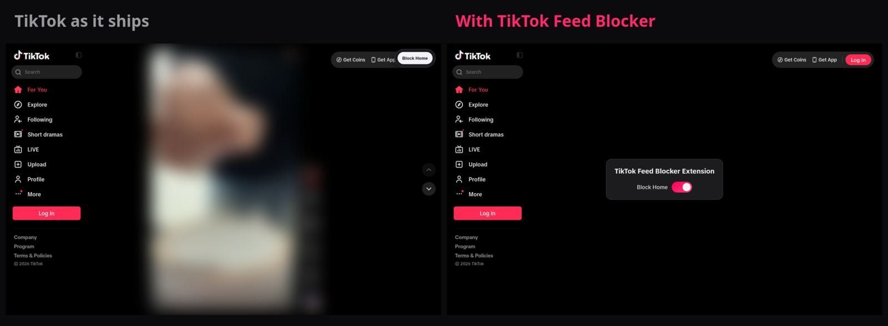
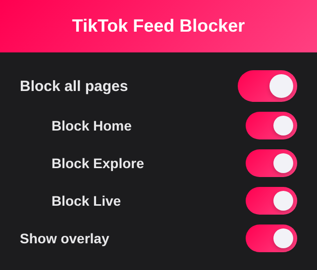
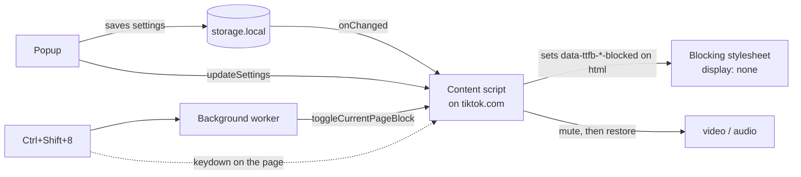

<div align="center">



# TikTok Feed Blocker

Hide TikTok's For You feed, Explore, and LIVE, and mute whatever plays behind
them. Search, messages, and profiles stay reachable.

[](https://chromewebstore.google.com/detail/tiktok-feed-blocker/hjagmapcdgdffjbbedipfoocmkmhbjeh)
[](https://addons.mozilla.org/firefox/addon/tiktok-feed-blocker/)
[](https://chromewebstore.google.com/detail/tiktok-feed-blocker/hjagmapcdgdffjbbedipfoocmkmhbjeh)
[](https://addons.mozilla.org/firefox/addon/tiktok-feed-blocker/)
[](https://chromewebstore.google.com/detail/tiktok-feed-blocker/hjagmapcdgdffjbbedipfoocmkmhbjeh)
[](LICENSE)



</div>

## Before and after



The feed in these captures is blurred on purpose. It is someone else's video.

## What gets blocked

| Page        | Hidden                                             | Muted                             |
| ----------- | -------------------------------------------------- | --------------------------------- |
| **For You** | The feed column, plus the comments panel if open   | Every video in the feed           |
| **Explore** | The grid on `/explore`                             | Previews inside the grid          |
| **LIVE**    | The live player on `/live`                         | All audio and video on the page   |

Each page has its own switch. Turning one off puts back exactly what was there,
including a video's previous volume and play state.

## Three ways to flip a switch

<table>
  <tr>
    <td width="320" valign="top">
      
    </td>
    <td valign="top">

**The popup.** One master switch, one per page, and a switch to hide the
in-page card if you would rather not see it.

**On the page.** A blocked page shows a card with its switch. An unblocked one
keeps a small **Block Home** (or Explore, or LIVE) button in the top-right
corner, so going back takes one click.

**The keyboard.** <kbd>Ctrl</kbd> + <kbd>Shift</kbd> + <kbd>8</kbd> toggles the
page you are on (<kbd>⌘</kbd> + <kbd>Shift</kbd> + <kbd>8</kbd> on macOS).
Rebind it at `chrome://extensions/shortcuts`, or from the gear menu in Firefox's
`about:addons`.

</td>
  </tr>
</table>

## Privacy

Settings live in the browser's local extension storage and never leave it. The
extension makes no network requests, asks only for `storage`, `activeTab`, and
access to `tiktok.com`, and the Firefox build declares that it collects no data.

## How it works



Hiding is pure CSS: blocking a page sets one attribute on `<html>`, so anything
TikTok renders later is hidden as it mounts. A stylesheet injected at
`document_start` keeps the feed hidden until settings load, which is why a
blocked page never flashes. Muting can't be done in CSS, so a sweep re-mutes
media as TikTok swaps it in. [docs/code-overview.md](docs/code-overview.md) has
the details.

## Build from source

```sh
pnpm install
pnpm build           # Chrome, into dist/
pnpm build:firefox   # Firefox, into dist-firefox/
```

Load `dist/` from `chrome://extensions` with Developer mode on, or
`dist-firefox/manifest.json` from `about:debugging` in Firefox.

Contributor docs (tests, build targets, release flow) start at
[docs/index.md](docs/index.md).

## License

[MIT](LICENSE)
